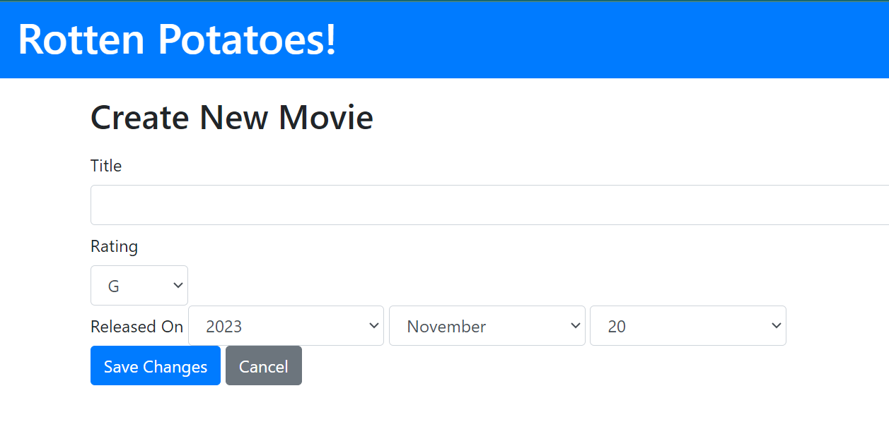
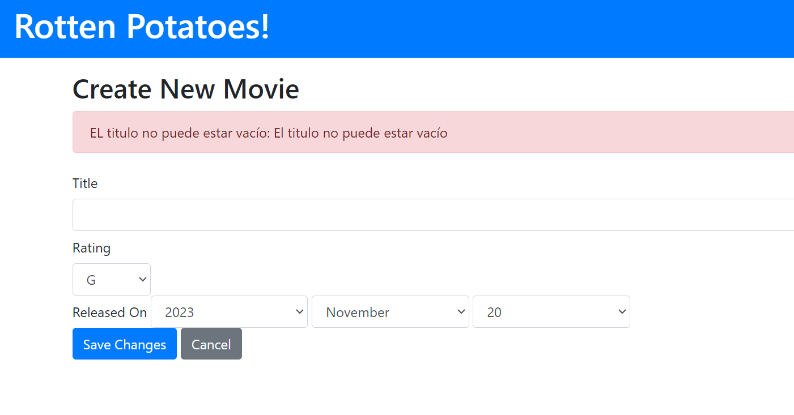
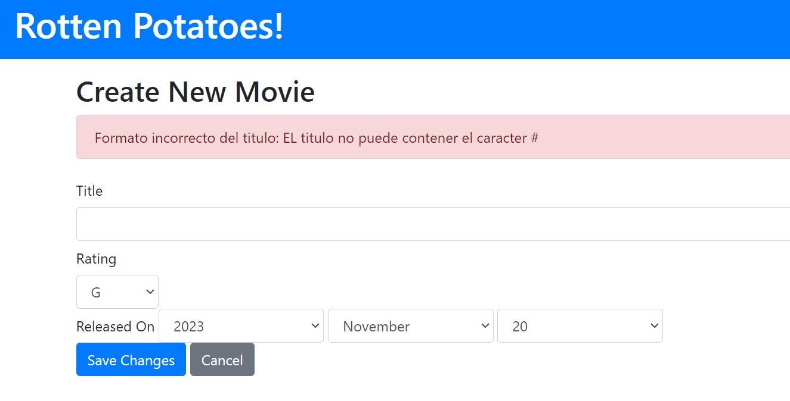

# Tarea PC03

Vamos a clonar nuestra PC3, y vamos a trabajar sobre ella creando algunas excepciones:

Primero implementamos la jerarquia de excepciones:

Creamos nuevas excepciones `TitleEmptyError` y `TitleFormatError` dentro de nuestra clase contrladora:

```ruby
class TitleEmptyError < StandardError
end

class TitleFormatError < StandardError
end
```

Ahora tenemos que hacer unos cambios en la clase controladora, especialemnte donde se crean las peliculas:

```ruby
def create
    begin
      raise TitleEmptyError, "El titulo no puede estar vacío" if movie_params[:title].blank?
      raise TitleFormatError, "EL titulo no puede contener el caracter #" if movie_params[:title].include?("#")
      if (@movie = Movie.create!(movie_params))
        flash[:notice] = "#{@movie.title} was successfully created."
        redirect_to movies_path and return
      end
    rescue TitleEmptyError => e
      flash.now[:alert] = "EL titulo no puede estar vacío: #{e.message}"
      render :new and return
    rescue TitleFormatError => e
      flash.now[:alert] = "Formato incorrecto del titulo: #{e.message}"
      render :new and return
    rescue => e
      flash.now[:alert] = "La película no ha podido ser creada: #{e.message}"
      render :new and return
    end
  end
```

En el archivo `app/controllers/movies_controller.rb` vamos a controlar las excepciones usando `begin` y `rescue`; primero definimos las excepciones:

```ruby
raise TitleEmptyError, "El titulo no puede estar vacío" if movie_params[:title].blank?
raise TitleFormatError, "EL titulo no puede contener el caracter #" if movie_params[:title].include?("#")
```
 y cuanndo la excepción se produce, debido a algun error en la creacion; el programa se detiene y se ejecuta el bloque `rescue` dependiendo de la excepción que se haya producido, tambien manda un mensaje de alerta junto al mensaje específico del tipo de excepción.

Agregamos tambien en la vista `new.html.erb` el código que nos permitirá ver los mensajes de las excepciones si es que se generan:

```html
<h2>Create New Movie</h2>

<% if flash.now[:alert] %>
  <div class="alert alert-danger">
    <%= flash.now[:alert] %>
  </div>
<% end %>
```

Esto nos permite mostrar un mensaje de alerta cuando se produzca un flash.now[:alert]

### Formulario Inicial:



Ahora cuando intentamos crear una nueva pelicula sin titulo, vemos el mensaje de la exceocion `TitleEmptyError` que se genero:



Ahora cuando intentamos crear una nueva pelicula con el caracter `#` en el titulo, vemos el mensaje de la exceocion `TitleFormatError` que se genero:



### Pregunta:
¿Que diferencias encuentras con lo indicado aquí https://codedamn.com/news/javascript/error-handling-debugging para Java Script?


En el artículo que se enfoca en el uso de Ruby, se resalta la imprtancia de establecer una jerarquía de excepciones como un paso clave para manejar los errores de manera efectiva. Por otro lado, en el artículo sobre JavaScript, se sugiere el empleo del bloque try-catch para gestionar las excepciones. En Ruby, se sigue un enfoque de control preciso de las excepciones, abogando por la creación de tipos específicos de excepciones para cada categoría de error, evitando así la necesidad de buscar detalladamente el tipo de error que pordía generar el programa.

En Ruby, se aconseja manejar las excepciones de manera selectiva, evitando rescatar más excepciones de las necesarias para no saturar el proceso de gestión de errores. También se destaca la importancia de no abordar las excepciones de inmediato después de su ocurrencia, sino de esperar para comprender cómo estos errores se propagn a lo largo de todo el código.

g
Respecto al manejo de errores en JavaScript, se presenta la opción de utilizar console logging como una herramienta para imprimir información relevante en la consola y comprender la ejecución del código. Además, se menciona el debugger como una herramienta que permite detener la ejecución del código en un punto específico, facilitando así la identificación y resolución de problemas.
